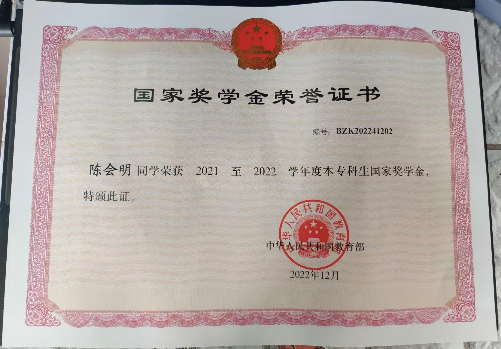
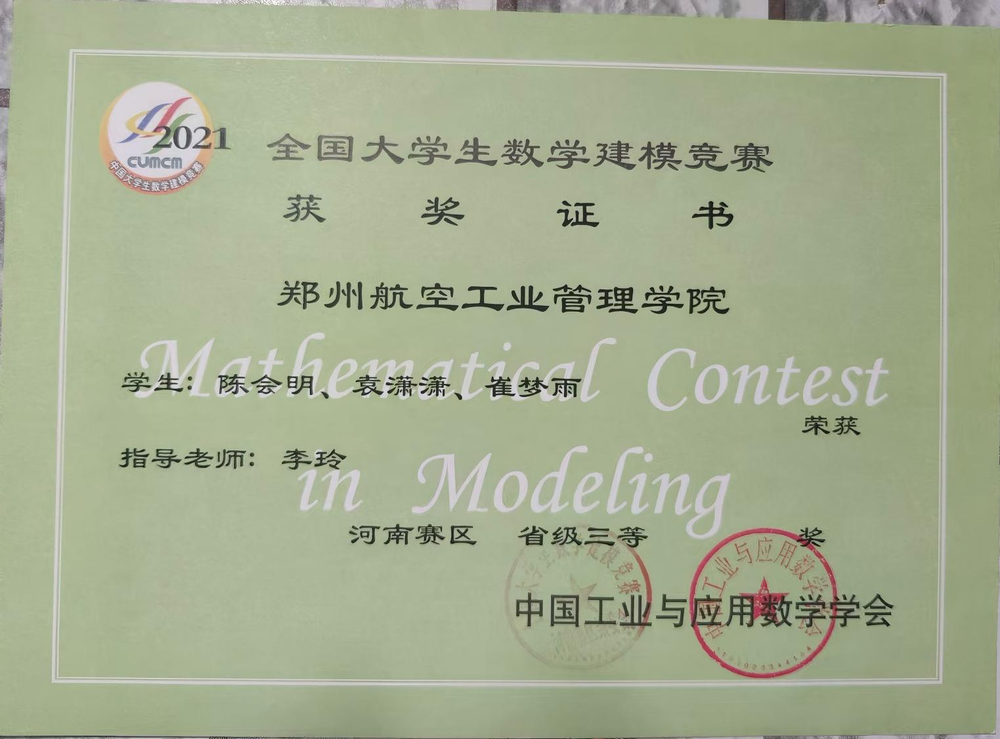

# 个人荣誉与成就 (Personal Honors & Achievements)

这里展示了我在学术研究、学科竞赛及综合素质方面的荣誉证明。

---

## 🎓 教育背景与成绩 (Academic Performance)

| 类别           | 说明               | 预览                                        |
| :------------- | :----------------- | :------------------------------------------ |
| **硕士成绩单** | 研究生阶段学业表现 | [查看成绩单](./硕士本科成绩/硕士成绩单.jpg) |
| **本科成绩单** | 本科阶段学业表现   | [查看成绩单](./硕士本科成绩/本科成绩单.jpg) |

---

## 🏆 核心荣誉证书 (Honors & Awards)

### 🥇 国家级荣誉 (National Level)
* **国家奖学金 (National Scholarship)** > 表彰学业成绩及综合素质排名前 0.2% 的顶尖学生。
    * [证书预览](./figure/国家奖学金.jpg)
* **国家励志奖学金 (National Encouragement Scholarship)**
    * [证书预览](./figure/国家励志奖学金.jpg)

### 🥈 竞赛获奖 (Competitions)
* **第十九届“挑战杯”全国人工智能擂台赛**（国家级奖项）
    * [证书预览](./figure/挑战杯证书.png)
* **全国大学生数学建模竞赛**（全国级奖项）
    * [证书预览](./figure/全国大学生数学建模竞赛.jpg)
* **“挑战杯”校级二等奖**
    * [证书预览](./figure/挑战杯校二等奖.jpg)

### 🎖 综合性荣誉 (Comprehensive Honors)
* **河南省优秀毕业生** (Provincial Outstanding Graduate)
    * [证书预览](./figure/河南省优秀毕业生.jpg)
* **三好学生标兵 / 三好学生** (Outstanding Student Leader / Student)
    * 包含 2019-2020、2020-2021、2021-2022 连续三学年荣誉。
    * [查看 21-22 标兵证书](./figure/三好学生标兵2021-2022.jpg) | [查看 20-21 证书](./figure/三好学生2020-2021.jpg)
* **校二等奖学金**
    * [证书预览](./figure/二等奖学金.jpg)

---

## 🖼 证书快照 (Gallery)

  
  
  

> **Note:** 更多详细材料可查阅本仓库的 `figure` 及 `硕士本科成绩` 文件夹。
